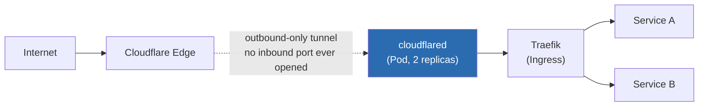

# Ingress + TLS Without a Cloud Load Balancer

On bare-metal / home-lab Kubernetes, there's no cloud provider to hand out a `LoadBalancer` IP. Two problems follow: how do external requests reach the cluster at all, and how does TLS get issued and renewed without a public-facing endpoint to run an HTTP-01 challenge against.



**Cloudflare Tunnel** solves reachability: `cloudflared` runs as a Pod and dials *out* to Cloudflare's edge — no inbound port is ever opened on the home router, no dynamic-DNS workaround for a changing WAN IP. See [`cloudflare-tunnel/deployment.yaml`](./cloudflare-tunnel/deployment.yaml) and [`configmap.yaml`](./cloudflare-tunnel/configmap.yaml).

**cert-manager + Let's Encrypt** solves TLS, issuing certificates via the DNS-01 challenge (not HTTP-01) — since there's no public inbound path for Let's Encrypt to reach an HTTP challenge endpoint, DNS-01 proves domain ownership through a DNS record instead, which works even though the origin is never directly reachable.

## Apply

```bash
kubectl create namespace ingress
kubectl create secret generic cloudflared-tunnel-creds \
  --from-file=credentials.json=<path-to-your-tunnel-credentials.json> \
  -n ingress
kubectl apply -f cloudflare-tunnel/configmap.yaml
kubectl apply -f cloudflare-tunnel/deployment.yaml
```

## Why this over a NodePort + router port-forward

A NodePort with router-level port-forwarding works, but it means the home router's public IP is directly reachable on that port — every scan of the IPv4 space finds it. The tunnel model means the *only* thing internet-reachable is Cloudflare's own edge; the cluster makes zero inbound listeners available to the public internet at all.
